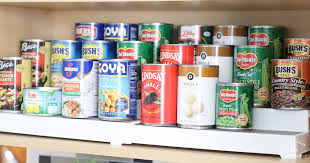

Our company **Cool Containers Inc** is interested in getting into the canning business.
We are looking for a calculus expert to help us determine the dimensions of a cylindrical can with the best possible shape.
In other words, for each volume we want to determine a radius and height which give that volume, but which minimize the amount of material required to create the can in order to minimize costs.

The responsibilities of the candidate we hire will be to:
1. Use calculus to determine the ideal radius-to-height ratio that will minimize the cost of the materials required to create the can of any volume.
2. Visit one or more grocery stores and measure the dimensions (radius and height) of several different sized cans on the shelf.  Carefully record the brand of each can and the kind of food it contains. (Ex. Coca-cola can, Chicken of the Sea tuna fish can, Ortega refried beans can, Planter's mixed nuts tin, and so on).
3. For each of the cans found, determine the difference between the amount of material used to create the can and how much material would be used to create a can of the same volume, but in the best possible shape.  What kinds of cans differed the most from the lowest-cost shape?  Come up with an explanation of why those cans might be designed that way.

The above questions should be addressed with a 3-5 page typed report, including explicit descriptions of the math involved as well as any useful figures, tables of data, graphs, etc.

