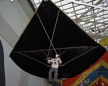
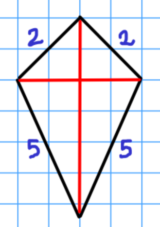

Want to help build the next generation of portable gliders?  Our startup company is designing a new portable glider with an ultra lightweight frame and next-generation fabric.

To fit our current frame design, the sides of the kite need to have the side lengths as depicted in the figure (units in meters).

That's where you come in.  In order to optimize the performance of the glider, we want to maximize the area of the cloth.  Using your mathematical expertise, determine the dimensions (width and height) which will give our design the best area.

To fulfill this commission, respond to this ad with a 3-5 page typed report describing a detailed analysis answering the following questions:

* What widths/heights are possible for the glider design, and what are the corresponding areas?
* What is the maximum area we can obtain, and what are the corresponding dimensions?
* If we change the frame size so that the side lengths are  and  rather than 2 and 5, what is the maximum area and what are the associated dimensions?

