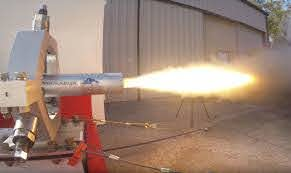
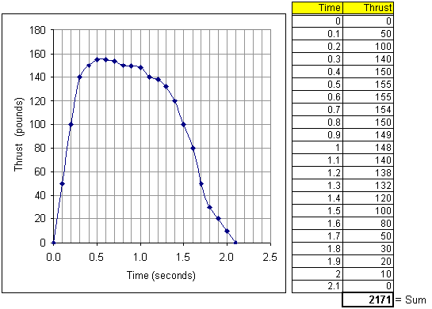

We are an amateur rocketry club specializing in engine design for ammonium-based rocket engine designs.  Recently, we developed and tested-fired a new 3d printed rocket engine design, as seen in the snapshot below.

The test-fire setup allows us to observe the thrust (force) produced by the engine over time.  Since nobody in our club has a math background, we are looking for help conducting analysis of the data.

Our club plans to install an identical engine in a rocket for a combined weight of 10 lbs, and we wish to predict the flight telemetry.  We are particularly interested in approximating both the peak velocity and the maximum height.

If interested, respond to this ad with a 3-5 page typed report addressing the following questions:

* What is the predicted velocity as a function of time?
* What is the predicted maximum velocity?
* What is the predicted height as a function of time?
* What is the predicted maximum height?

Our club would like to perform similar analysis in the future on our own, so an in-depth explanation of the methods and mathematics involved is paramount.

