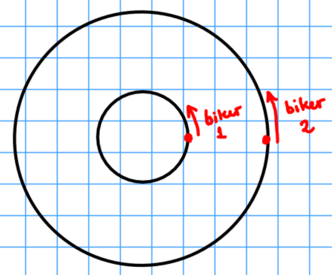

Our company creates CGI images and video on commission.  Our most recent production involves two motorcycles driving in a concentric circular pattern as depicted below.

In order to complete the project, we need to create audio of motorcycle engines, as heard from the position of one of the bikers.  While we have audio of motorcycle engines, we still need to adjust the frequency to account for the effects of doppler shift.

If you are interested in this commission, please reply to this ad with a 3-5 page typed report describing how the engine frequency of biker 2 should be adjusted as heard by biker 1.  Include a detailed description of all methods and analyses.  You should assume the following:

* the inner circle and outer circles have radii of 50 and 100 meters, respectively
* both bikers initially start at the far-right point of their respective circles
* both bikers maintain constant speeds
* biker 1 (in the inner circle) completes 1 revolution every 3 minutes
* biker 2 (in the outer circle) completes 1 revolution every minute

