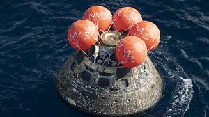

Based on experience from the first two Artemis missions, NASA needs 

After NASA’s Orion capsule has splashed down, recovery teams need a fast search radius estimate in case visual contact is briefly lost.  Your objective in this project is to determine a formula describing the maximum distance the capsule could be after a certain time $$t$$ in hours.  Assume the capsule’s distance $$r(t)$$ from the splashdown point is differentiable, and ocean data show its sea surface speed never exceeds 1.8 miles per hour after splashdown. How far from the splashdown point could the capsule be after 2 hours?  If instead the sea surface speed starts to increase over time, so that it is $$s(t) = 0.1t +1.8$$.  How far should the search area be set now?

Lives could depend on the correctness of the formula you obtain for the search radius, so your answer should be carefully justified in order to sucessfully complete this commission.
Please reply to this ad with a 3-5 page typed report describing your solution and careful justification.

